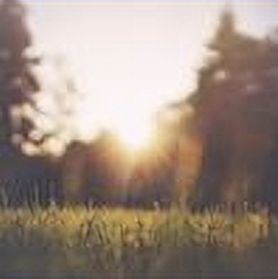

# Website

This website is built using [Docusaurus 2](https://docusaurus.io/), a modern static website generator.

### Installation

<<<<<<< HEAD:docs/README.md
```
$ yarn
=======
```javascript
({
  patchSize: 64,
  padding: 5,
})
>>>>>>> main:docs/src/pages/index.md
```

### Local Development

```
$ yarn start
```

This command starts a local development server and opens up a browser window. Most changes are reflected live without having to restart the server.

### Build

```
$ yarn build
```

This command generates static content into the `build` directory and can be served using any static contents hosting service.

### Deployment

Using SSH:

```
$ USE_SSH=true yarn deploy
```

Not using SSH:

```
<<<<<<< HEAD:docs/README.md
$ GIT_USER=<Your GitHub username> yarn deploy
```

If you are using GitHub pages for hosting, this command is a convenient way to build the website and push to the `gh-pages` branch.
=======

### `dispose`

Disposes the current model. Must be called to free up memory when the Upscaler is no longer needed.

#### Example

```javascript
await upscaler.dispose();
```

### `abort`

Aborts all inflight `upscale` calls.

#### Example

```javascript
await upscaler.abort();
```

## Troubleshooting

### Padding is undefined

If specifying a patch size but not padding, you will likely encounter artifacting in the upscaled image.


Most of the time, this artifacting is undesired. To resolve the artifacting, add an explicit padding:

```javascript
upscaler.upscale('/path/to/img', {
  patchSize: 64,
  padding: 4,
})
```



If you would like to keep artifacting but hide the warning message, pass an explicit padding value of 0:

```javascript
upscaler.upscale('/path/to/img', {
  patchSize: 64,
  padding: 0,
})
```

### Progress Specified Without Patch Size

If you've specified a `progress` callback but are not specifying `patchSize` in the call to `upscale`, the `progress` callback will never be called. `progress` callbacks only occur when `patchSize` is provided.

In order to have your `progress` callback be called, provide explicit patch sizes:

```javascript
upscaler.upscale('/path/to/img', {
  patchSize: 64,
  progress: ...
})
```
## Contributions 

Contributions are welcome! Please follow the existing conventions, use the linter, add relevant tests, and add relevant documentation.

## Support

* Create a [Github issue](https://github.com/thekevinscott/UpscalerJS/issues) for bug reports, feature requests, or questions
* Follow [@thekevinscott](https://twitter.com/thekevinscott) for announcements
* Add a ⭐️ [star on GitHub](https://github.com/thekevinscott/UpscalerJS) or ❤️ [tweet](https://twitter.com/intent/tweet?url=https%3A%2F%2Fgithub.com%2Fthekevinscott%2Fupscaler&via=thekevinscott&hashtags=javascript,image-enhancement,tensorflow.js,super-resolution) to support the project!

## License

This project is licensed under the MIT License. See the [LICENSE](https://github.com/thekevinscott/UpscalerJS/blob/master/LICENSE) for details.

Copyright (c) Kevin Scott ([@thekevinscott](https://thekevinscott.com))

>>>>>>> main:docs/src/pages/index.md
