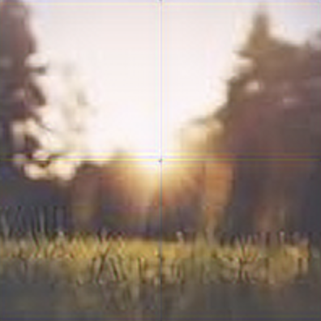

# Troubleshooting

Upscaler.js will occasionally raise an error or log a warning to the console. This page details those circumstances and how you can avoid them.

## "You must provide an explicit scale"

When initializing UpscalerJS with a custom model, you need to also denote the numeric scale of the model (2x, 3x, 4x). UpscalerJS needs to know the scale in order to patch correctly.

Scale can be provided at initialization with:

```javascript
const upscaler = new Upscaler({
  model: '/your/custom/model',
  scale: 2,
})
```

## "You are requesting the pretrained model but are providing an explicit scale"

A pretrained model is trained to upscale to a specific scale. If you initialize UpscalerJS with a pretrained model and also provide an explicit scale, UpscalerJS will throw an error.

You can fix this by not providing a `scale` property if using a pretrained model:

```javascript
const upscaler = new Upscaler({
  model: 'div2k-2x',
})
```

## "Padding is undefined"

If specifying a patch size but not padding, you will likely encounter artifacting in the upscaled image.



Most of the time, this artifacting is undesired. To resolve the artifacting, add an explicit padding:

```
upscaler.upscale('/path/to/img', {
  patchSize: 64,
  padding: 4,
})
```


If you would like to keep artifacting but hide the warning message, pass an explicit padding value of 0:

```
upscaler.upscale('/path/to/img', {
  patchSize: 64,
  padding: 0,
})
```

## "Progress Specified Without Patch Size"

If you've specified a `progress` callback but are not specifying `patchSize` in the call to `upscale`, the `progress` callback will never be called. `progress` callbacks only occur when `patchSize` is provided.

In order to have your `progress` callback be called, provide explicit patch sizes:

```
upscaler.upscale('/path/to/img', {
  patchSize: 64,
  progress: ...
})
```
